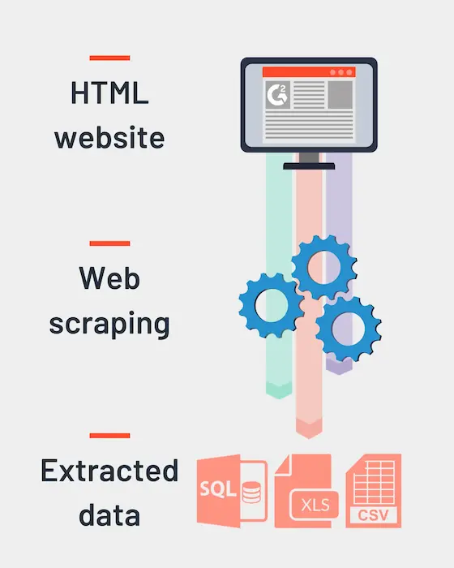

# Web scraping: Extracción de datos de la web

El web scraping es el proceso de extraer datos de sitios web. Te permite automatizar la obtención de información de diversas páginas web, lo cual puede ser útil para una variedad de propósitos, incluyendo análisis de datos, investigación y desarrollo de aplicaciones.

## ¿Cómo Funciona el Web Scraping?

El web scraping generalmente implica enviar una solicitud HTTP a una página web, analizar el contenido HTML de la página y luego extraer la información deseada. Esta información puede ser texto, imágenes, enlaces u otro contenido disponible en la página web.

Existen varias herramientas y bibliotecas disponibles para el web scraping en diferentes lenguajes de programación, como BeautifulSoup, Scrapy o Selenium en Python, y Cheerio en Node.js.

## Consideraciones Legales y Éticas

Si bien el web scraping puede ser una herramienta poderosa, es esencial ser consciente de consideraciones legales y éticas. No todos los sitios web permiten el scraping de su contenido, y hacer scraping de grandes cantidades de datos de un sitio web sin permiso puede violar sus términos de servicio o leyes de derechos de autor. Siempre verifica los términos de uso de un sitio web y respeta sus pautas.

## Mejores Prácticas

Al realizar web scraping, es importante seguir las mejores prácticas para evitar ser bloqueado por los sitios web o causar interrupciones en sus servidores. Algunas mejores prácticas incluyen:

- **Respetar robots.txt**: Muchos sitios web tienen un archivo `robots.txt` que especifica qué páginas se pueden y no se pueden scrapear. Siempre cumple con las reglas descritas en este archivo.

- **Limitar la Tasa de Solicitudes**: Implementa límites de tasa en tus scripts de scraping para evitar enviar demasiadas solicitudes al servidor de un sitio web en un corto período. Esto ayuda a prevenir que tu dirección IP sea bloqueada.

- **Usar un User-Agent**: Establece un encabezado de user-agent en tus solicitudes HTTP para identificar tu script de scraping. Algunos sitios web pueden bloquear solicitudes de bots con user-agents genéricos.

- **Evitar Sobrecargar Servidores**: Considera la capacidad del servidor del sitio web y evita realizar demasiadas solicitudes simultáneas. Distribuye tus solicitudes en el tiempo para evitar sobrecargar el servidor.

## Aplicaciones del Web Scraping

El web scraping tiene una amplia gama de aplicaciones en diversas industrias:

- **Investigación de Mercado**: Scraping de sitios web de comercio electrónico para recopilar información de precios o reseñas de productos.

- **Agregación de Contenido**: Recopilación de artículos de noticias, publicaciones de blogs o publicaciones en redes sociales de diferentes fuentes para análisis o visualización.

- **Generación de Leads**: Extracción de información de contacto de sitios web para fines de ventas y marketing.

- **Monitoreo y Alertas**: Seguimiento de cambios en sitios web, como precios de acciones o publicaciones de empleo, y enviar alertas basadas en criterios predefinidos.

## Conclusión

El web scraping es una técnica valiosa para extraer datos de sitios web para diversos propósitos. Sin embargo, es fundamental abordarlo de manera responsable, respetando los límites legales y éticos, y siguiendo las mejores prácticas para garantizar el buen funcionamiento tanto de tus scripts de scraping como de los sitios web que scrapeas. Con el cuidado y la atención adecuados, el web scraping puede ser una herramienta poderosa para recopilar y analizar datos de la vasta extensión de Internet.
